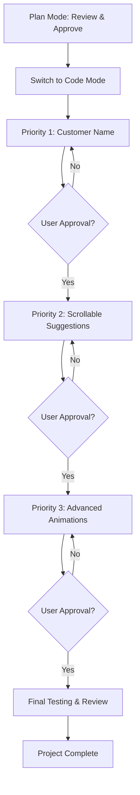

# Plan Summary - Website Enhancement Project

## 📊 Project Overview

**Project:** Srinivasa Traders Billing System Enhancement  
**Goal:** Modernize the UI with advanced CSS features, animations, and improved UX  
**Approach:** Incremental implementation with approval gates

---

## 📁 Planning Documents Created

### 1. **ENHANCEMENT_PLAN.md** (346 lines)
Comprehensive plan covering:
- Priority 1: Customer Name Field
- Priority 2: Scrollable Product Suggestions  
- Priority 3: Advanced Animations & Transitions
- CSS Variables, Keyframes, Advanced Selectors
- Design principles and technical notes

### 2. **VISUAL_MOCKUP.md** (318 lines)
Visual representations including:
- Before/After UI comparisons
- Feature mockups with ASCII art
- Animation sequences
- Color schemes and gradients
- Responsive behavior examples

### 3. **IMPLEMENTATION_GUIDE.md** (847 lines)
Technical implementation details:
- Complete code examples for all features
- State management patterns
- CSS styling with exact line numbers
- JavaScript enhancements
- Step-by-step checklists

---

## 🎯 Implementation Priorities

### ✅ Priority 1: Customer Name Field
**What:** Add input field to capture customer names  
**Where:** Above billing terminal in right panel  
**Features:**
- Bilingual support (English/Telugu/Mix)
- Auto-save functionality
- Clear button with animation
- Print on receipt
- Focus glow effects

**Files to Modify:**
- `client/src/App.jsx` - Add state & component
- `client/src/index.css` - Add styling & animations

**Estimated Complexity:** Medium  
**Estimated Time:** 30-45 minutes

---

### ✅ Priority 2: Scrollable Suggestions
**What:** Enhanced autocomplete dropdown with smooth scrolling  
**Where:** Billing terminal search suggestions  
**Features:**
- Maximum height with smooth scroll
- Fade gradients at edges
- Custom scrollbar styling
- Auto-scroll to selected item
- Keyboard navigation improvements

**Files to Modify:**
- `client/src/App.jsx` - Add scroll helper function
- `client/src/index.css` - Enhanced dropdown styles

**Estimated Complexity:** Medium  
**Estimated Time:** 30-45 minutes

---

### ✅ Priority 3: Advanced Animations
**What:** Modern CSS animations and transitions  
**Where:** Throughout the application  
**Features:**
- CSS Custom Properties (variables)
- @keyframes animation library
- Advanced selectors (nth-child, focus-within)
- Hover effects and transitions
- Ripple effects on buttons
- Gradient animations
- Loading skeletons
- Pulsing indicators

**Files to Modify:**
- `client/src/index.css` - Extensive CSS additions

**Estimated Complexity:** High  
**Estimated Time:** 60-90 minutes

---

## 📋 Complete Feature List

### Customer Name Field
- [x] Planning complete
- [ ] State management implementation
- [ ] Component structure
- [ ] CSS styling
- [ ] Print receipt integration
- [ ] Testing

### Scrollable Suggestions
- [x] Planning complete
- [ ] CSS enhancements
- [ ] Fade gradients
- [ ] Custom scrollbar
- [ ] Auto-scroll function
- [ ] Testing

### CSS Variables
- [x] Planning complete
- [ ] Animation timings
- [ ] Easing functions
- [ ] Spacing system
- [ ] Z-index layers
- [ ] Glow effects

### Keyframe Animations
- [x] Planning complete
- [ ] Pulse animation
- [ ] Glow pulse
- [ ] Shimmer loading
- [ ] Bounce in
- [ ] Slide animations
- [ ] Shake effect
- [ ] Gradient shift
- [ ] Rotate & float

### Advanced Selectors
- [x] Planning complete
- [ ] Nth-child patterns
- [ ] Focus-within effects
- [ ] Attribute selectors
- [ ] Pseudo-classes
- [ ] Hover effects

### Interactive Effects
- [x] Planning complete
- [ ] Card hover lift
- [ ] Button ripple
- [ ] Gradient animations
- [ ] Loading skeletons
- [ ] Pulsing indicators
- [ ] Staggered fade-ins

---

## 🔄 Implementation Workflow

---

## 💡 Key Technical Decisions

### 1. **CSS-First Approach**
- Leverage CSS for animations (GPU accelerated)
- Minimal JavaScript for interactions
- Better performance and maintainability

### 2. **Progressive Enhancement**
- Core functionality works without animations
- Respects `prefers-reduced-motion`
- Graceful degradation for older browsers

### 3. **Design Token System**
- CSS Custom Properties for consistency
- Easy theme customization
- Centralized value management

### 4. **Accessibility First**
- Keyboard navigation support
- ARIA labels where needed
- Focus indicators
- Reduced motion support

---

## 📊 Success Metrics

### User Experience
- ✅ Customer name captured for receipts
- ✅ Smooth scrolling in suggestions
- ✅ Visual feedback on interactions
- ✅ Professional, modern appearance

### Technical Quality
- ✅ 60fps animations
- ✅ No layout shifts
- ✅ Accessible to all users
- ✅ Mobile responsive

### Code Quality
- ✅ Maintainable CSS structure
- ✅ Reusable animation patterns
- ✅ Well-documented code
- ✅ Consistent naming conventions

---

## 🚀 Next Steps

### Immediate Actions:
1. **Review all planning documents**
2. **Approve the implementation plan**
3. **Switch to Code mode**
4. **Begin Priority 1 implementation**

### Implementation Order:
1. Customer Name Field (30-45 min)
2. Scrollable Suggestions (30-45 min)
3. Advanced Animations (60-90 min)

### Total Estimated Time: 2-3 hours

---

## 📝 Notes for Implementation

### Important Reminders:
- ✅ Get approval after each priority
- ✅ Test on multiple screen sizes
- ✅ Verify print functionality
- ✅ Check keyboard navigation
- ✅ Test with real data
- ✅ Verify bilingual support

### Files to Modify:
- `client/src/App.jsx` (React component)
- `client/src/index.css` (Styling & animations)

### Files to Keep Unchanged:
- `server.js` (Backend)
- `products.json` (Data)
- `client/index.html` (HTML structure)
- Other configuration files

---

## 🎨 Design Philosophy

**"Make it beautiful, make it functional, make it fast"**

1. **Beautiful:** Modern glassmorphism, smooth animations
2. **Functional:** Improved UX, better workflows
3. **Fast:** GPU-accelerated, optimized performance

---

## ✅ Ready for Implementation

All planning is complete. The implementation guide provides:
- ✅ Exact code to add
- ✅ Line numbers for insertion
- ✅ Complete CSS styles
- ✅ JavaScript enhancements
- ✅ Testing checklists

**Status:** Ready to switch to Code mode and begin implementation.

---

*Created: 2026-06-19*  
*Mode: Plan*  
*Next: Switch to Code mode for implementation*